# Cultivation furniture v0.0.1

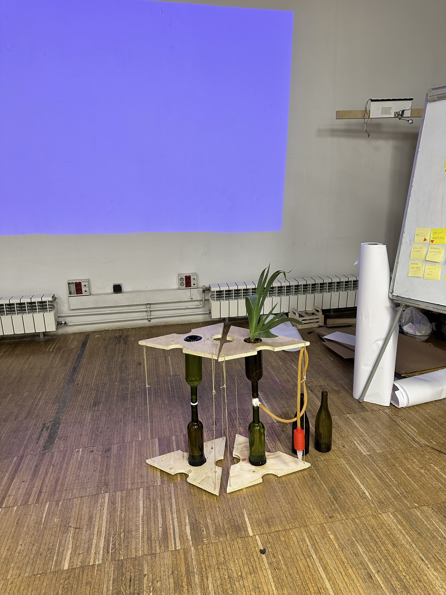

This repo documents my first attempt at designing and building a prototype for modular furniture in which you can store water (required for life) and grow things (plants, mushrooms, microorganisms, materials) in an urban home. It fits into a broader project together with the Flowing Futures collective (see repo [add link here]() ).

## the idea

Our agriculturtal and industrial production systems play an important role in the continued destruction of and extraction from our environments. Our dependence on it also plays a role in our reliance on work to secure our subsitence. This is especially stark in urban environments, and (among those who have a permanent home) especially for people who live in apartments. 

Cultivation furniture is a practical exploration (about how can we grow some of the things we need and want in our own homes) as well as way to invite people to reimagine the function and experience of domestic spaces. 

To begin making this idea a reality, I tried to find a minimum viable furniture.

## the process (what i did)

I landed on a small coffee table or bedside table as an initial furniture. The idea was to make it as modular as possible. That is why I opted for a triangle as a top / bottom shape (due to the ease of making various shape out of many triangles). The size of the triangle was chosen based on the size of wine bottles when arranged in either a very compact setup (which is not the one I opted for for the first iteration), or a more airy, simple setu, where wine bottles are only present in the center of the triangle and on the connecting sides. 

The cultivation I opted for in this first iteration is wick hydroponics. This is commonly described as the most simple hydroponics setup. It involves a substrate at the top (in this case, in the upper wine bottle, the base of which was cut off), and a nutriment solution at the bottom (the lower wine bottle, int this case). The two containers are connected via a wick (e.g an old textiele, or some string). The nutriment solution travels up to the plant's roots in the substrate via capillary action (for an explanation, see, for example: https://www.trees.com/gardening-and-landscaping/hydroponic-wick-systems).inital 

After initial drawings and musings I visualised my initial ideas in 3D by building an extremely rough prototype:
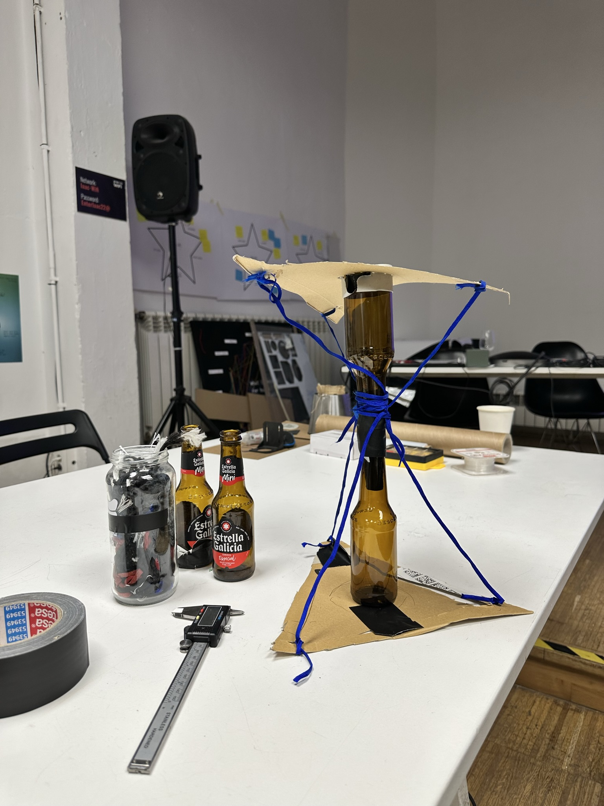

Much still had to be determined, e.g. the way the two trianglee boards should be connected.

After much thinking about how bottles could be arranged (and thus, how large the triangles should be)....

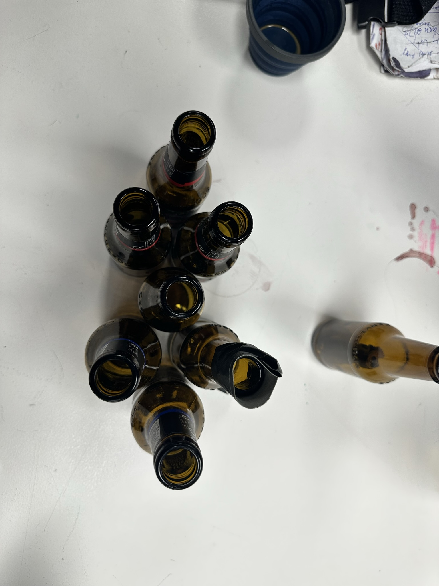

... I opted for a model where a central bottle could be surrounded by three more, and then connected to other triangles by another three. After prototyping in thin wood with a lasercutter and seeing what it looked like on 0.25L bottles, I cut it in plywood using Fablab Barcelona's CNC because that's what was available where I was. You could use any number of other materials, variations on shape and size. 

Somewhere in-between thinking about the triangles, I was also exploring various ways of connecting the wine bottles. 

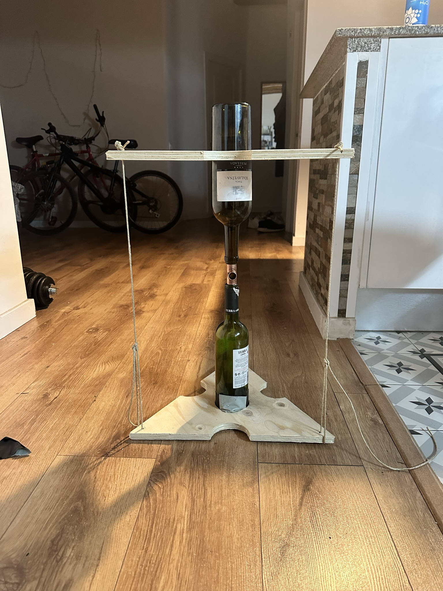
h
For example, I got enthralled with the aesthetic qualities of copper and latex tubing, so tried to build a contraption out of 18mmm copper connecctors and latex tubes. Unfortunately, this didn't work because the copper connectors didn't fit into the bottle.

While it didn't work out in the end, it did allow me to see if the modular setup made sense (I tought it did). Some tape was also requiree (as always..).

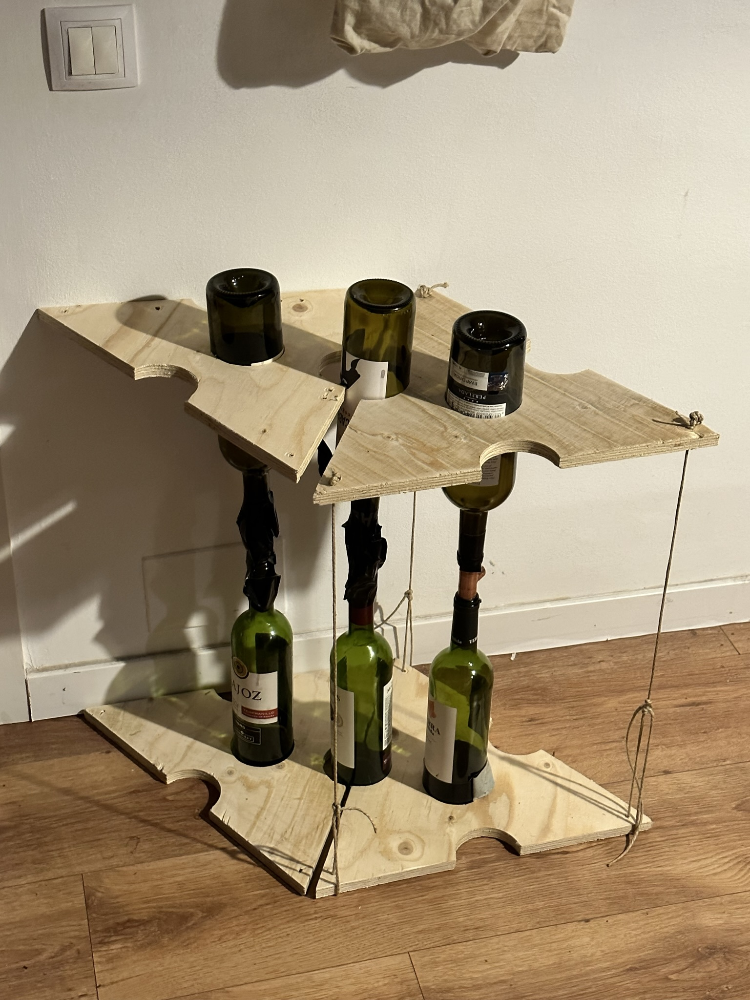

Since the copper version didn't work, I set out to find a different solution. I had a 3D printer at home, so I went for a solution involving that. 

To better understand what would work as well as the size of my wine bottle including differences in the flexibility of my PLA filament and to test my (new) 3D printer etc, I decided to print out an oil dispenser add-on for wine bottles (that I found on thingiverse: https://www.thingiverse.com/thing:4727790). 

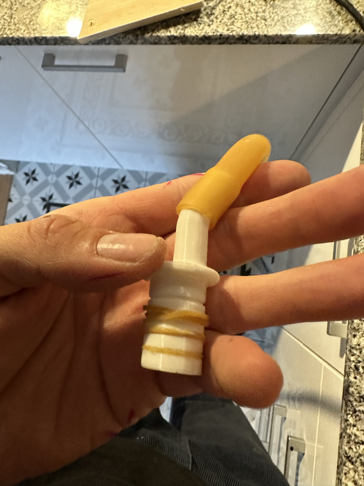

in this image you can also see an idea that emerged in that moment, which is to use ordinary elastic bands to create a seal.

With the rough method of production (3D printing with rubber bands) confirmed, I set out to create or find a model to connect the two bottles. Instead of drawing one myself, I decided to just scale two models I found on thingiverse to the size I needed: first a [simple connection](https://www.thingiverse.com/thing:5989941), and then a [T connector](https://www.thingiverse.com/thing:2204659) which allows us to add a water tube. These are originally designed for pneumatic tubes and hoses, respectively. Printed at 100% infill and with supports, they work fine with wine bottles.

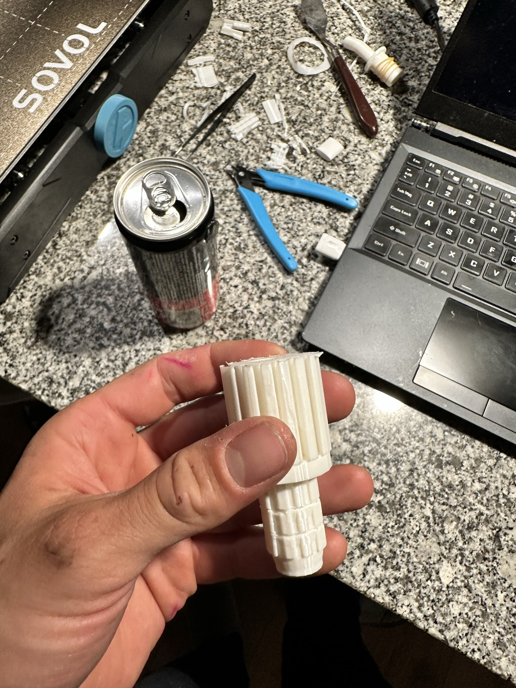

For the T connecctor, I believe due to me (or/and the default of Cura) positioning it horizontally instead of vertically, it was a bit of a pain to remove the supports that got built on the inside. 

Two problems were now left to be solved. The first, since I wanted to make a hydroponic setup, whith a plant growing out of it, I needed to cut the bottle. So far, the process I used is not perfect. It involves pre-cutting with a glass cutter...

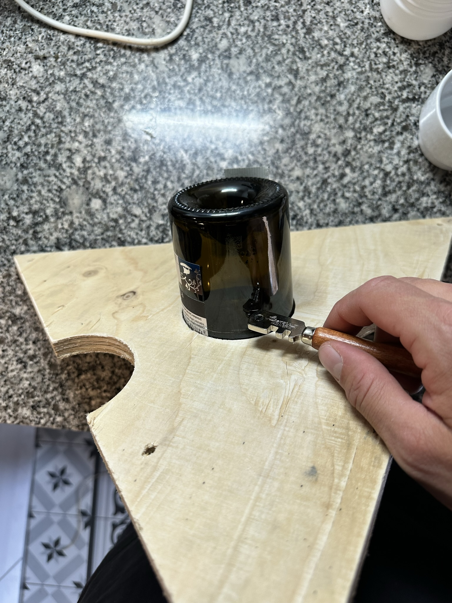

... heating the cut.. (for example by dipping some string into acetone and setting it on fire. 

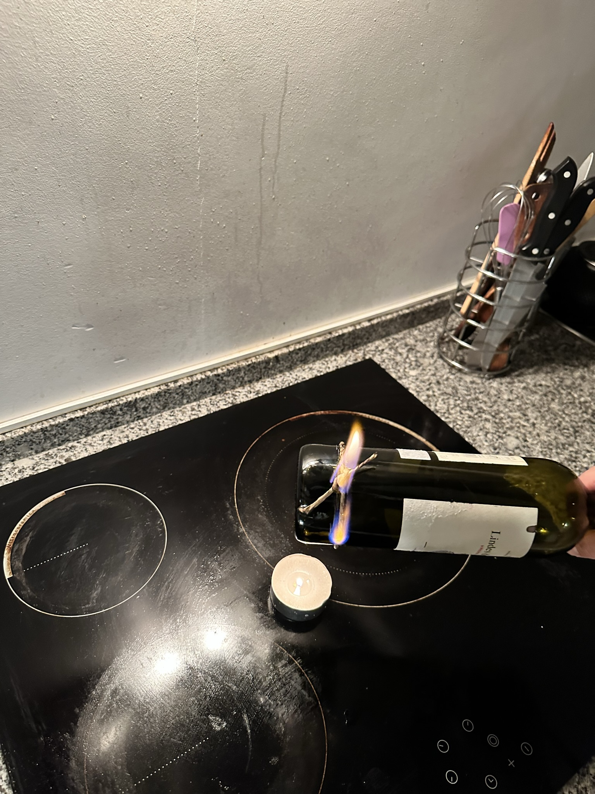

and then plunging it into ice-cold water (didn't take a picture of that). 

The second problem is how to connect the two wooden triangles. After rejecting initial ideas of connecting them with rigid materials as well as of connecting everything to a central 3D printed part (creating a fragile single point of failure), I opted for connecting them with string using the following knot:

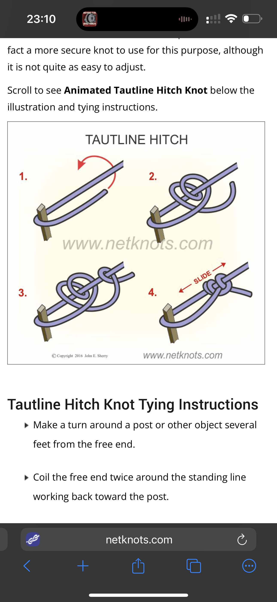
source: https://www.netknots.com/rope_knots/tautline-hitch

This allows us to increase tension continuously until we have the required balance between the three strings and the required tension overall. 

Bringing all elements together, this is the result:

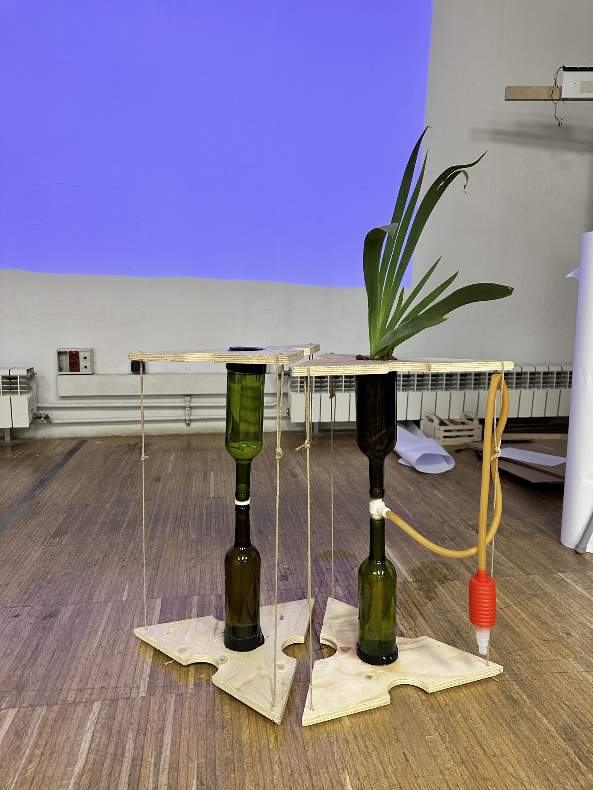

## replication (how to build it)

To replicate this prototype, you can refer to the steps described above, but focusing on the useful ones. The files you need for that are all available in this repo (see the steps below).

### bill of materials (what you will need)

#### machines (can partly be replaced by manual labour)
* CNC (can be replaced)
* 3D printer (harder to replace)

#### tools

#### other materials

* plywood or any other relatively thick material

#### optional

### recipe (step by step, how to make it)

Here is an overview of the steps.

1) Prepare the file for the CNC, potentially based on this [file](/BIGtriangleThoing.3dm)

